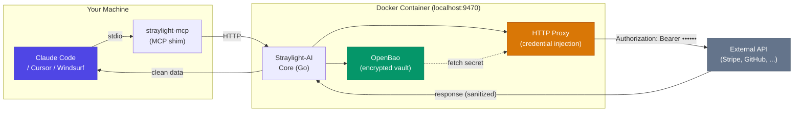
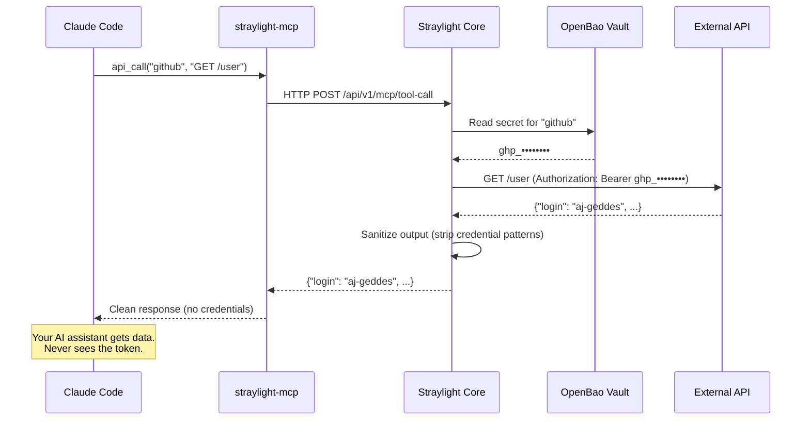

<p align="center">
  
</p>

<h1 align="center">Straylight-AI</h1>

<p align="center"><strong>Keep your API keys safe when using Claude Code, Cursor, and Windsurf.</strong></p>
<p align="center"><em>Use AI, with Zero trust.</em></p>

<p align="center">
  <a href="https://github.com/aj-geddes/straylight-ai/actions"></a>
  <a href="https://github.com/aj-geddes/straylight-ai/releases"></a>
  <a href="LICENSE"></a>
  <a href="https://aj-geddes.github.io/straylight-ai/docs/quickstart"></a>
</p>

## The Problem

Every time Claude Code reads your `.env` file, accesses shell history, or processes
log output, your API keys enter its context window. From there they can be echoed
in responses, logged to disk, or exfiltrated through prompt injection.

**This isn't theoretical.** CVE-2025-59536 demonstrated credential leakage via
crafted API responses. CVE-2026-21852 showed API key exfiltration through malicious
project configs.

## The Solution

Straylight-AI is a self-hosted credential proxy that sits between your AI coding
assistant and the outside world. You paste your API keys into a secure vault once.
When Claude Code, Cursor, or Windsurf needs to call an API, Straylight injects the
credential at the HTTP transport layer — **your keys never appear in the AI's
context window, prompts, logs, or responses.**

## Quick Start

### Prerequisites

- Docker or Podman
- Node.js 18+

### Install (One Command)

```bash
npx straylight-ai
```

This will:
1. Pull and start the Straylight-AI container
2. Open the dashboard at http://localhost:9470
3. Register the MCP server with Claude Code (if installed)

### Add a Service

1. Open http://localhost:9470
2. Click "Add Service"
3. Select a template (GitHub, Stripe, OpenAI, etc.) or create a custom service
4. Paste your API key — it goes straight into the encrypted vault
5. Done. The key is stored securely and will never be shown again.

### Connect to Claude Code

If not auto-registered during setup:

```bash
claude mcp add straylight-ai --transport stdio -- npx straylight-ai mcp
```

### Works with Cursor and Windsurf Too

Any MCP-compatible AI coding assistant can use Straylight-AI. The MCP server
speaks the standard protocol over stdio.

### Use It

Just work normally with your AI coding assistant:

- "Check my GitHub issues"
- "What's my Stripe balance?"
- "Create an OpenAI completion"

Claude Code sees the Straylight-AI MCP tools and uses them automatically. Your
credentials never enter the conversation.

## How It Works



### Data Flow



The `straylight-mcp` shim runs on your host and communicates with your AI coding
assistant via stdio. It forwards MCP tool calls to the container over localhost
HTTP. The container fetches credentials from the encrypted vault and injects them
into outbound requests — **the AI only ever sees the API response, never the key.**

## Supported Services

Straylight-AI ships with 16 pre-configured templates:

| API Services | Cloud Providers | Databases | Other |
|-------------|----------------|-----------|-------|
| GitHub | AWS | PostgreSQL | SSH Keys |
| Stripe | Google Cloud | MySQL | Custom REST APIs |
| OpenAI | Azure | MongoDB | |
| Anthropic | | Redis | |
| Slack | | | |
| GitLab | | | |
| Google | | | |

Each service supports multiple auth methods (PATs, API keys, service account
JSON, connection strings, etc.) — pick the one that matches your credential.

## CLI Reference

| Command | Description |
|---------|-------------|
| `npx straylight-ai` | Full setup (pull, start, register) |
| `npx straylight-ai start` | Start the container |
| `npx straylight-ai stop` | Stop the container |
| `npx straylight-ai status` | Check health and service status |

## MCP Tools

Once registered, your AI coding assistant has access to these tools:

| Tool | What It Does |
|------|-------------|
| `straylight_api_call` | Make an authenticated HTTP request. Credentials injected automatically. |
| `straylight_exec` | Run a command with credentials as environment variables. Output sanitized. |
| `straylight_check` | Check whether a credential is available for a service. |
| `straylight_services` | List all configured services and their status. |

### Example

Your AI assistant calls:
```json
{ "service": "stripe", "method": "GET", "path": "/v1/balance" }
```

Straylight injects `Authorization: Bearer sk_live_...` into the request. The AI
gets the balance data back. It never sees or handles the key.

## Claude Code Hooks (Optional)

For extra protection, add PreToolUse and PostToolUse hooks that block commands
like `echo $STRIPE_API_KEY` before they execute, and sanitize any credential
patterns that slip into tool output.

Add to `.claude/settings.json`:

```json
{
  "hooks": {
    "PreToolUse": [{
      "matcher": "Bash|Write|Edit",
      "hooks": [{ "type": "command", "command": "straylight-mcp hook pretooluse" }]
    }],
    "PostToolUse": [{
      "matcher": "Bash",
      "hooks": [{ "type": "command", "command": "straylight-mcp hook posttooluse" }]
    }]
  }
}
```

## Security

- **Encrypted at rest** — OpenBao (open-source HashiCorp Vault fork)
- **Transport-layer injection** — credentials added to HTTP requests inside the container, never exposed to the AI
- **Output sanitization** — two-layer detection strips credential patterns from API responses before they reach the AI
- **Non-root container** — runs as UID 10001, read-only filesystem, all capabilities dropped
- **Rate limiting and CORS** — dashboard locked to localhost

## FAQ

**Does my AI coding assistant ever see my credentials?**
No. Credentials stay inside the vault. The proxy injects them into HTTP requests.
The AI only receives the API response, which is also sanitized for credential patterns.

**Does this work with Cursor and Windsurf?**
Yes. Any MCP-compatible AI coding assistant works. The MCP server speaks the
standard protocol over stdio.

**What happens if I restart the container?**
Credentials persist in the Docker volume at `~/.straylight-ai/data/`. The
container re-unseals the vault and is operational within seconds.

**Can I use services not on the template list?**
Yes. Select "Custom Service" and provide the base URL and auth method.

**Is this open source?**
Yes. MIT license. Self-hosted. No cloud dependency.

## Troubleshooting

**`npx straylight-ai` says Docker is not found**

Install Docker: https://docs.docker.com/get-docker/

**MCP tools not visible in Claude Code**

```bash
claude mcp add straylight-ai --transport stdio -- npx straylight-ai mcp
```
Then restart Claude Code.

**Container health check fails**

```bash
npx straylight-ai status
npx straylight-ai logs
```

## Documentation

| Guide | Description |
|-------|-------------|
| [Quick Start](https://aj-geddes.github.io/straylight-ai/docs/quickstart) | 5-minute setup guide |
| [User Guide](https://aj-geddes.github.io/straylight-ai/docs/user-guide) | Complete reference |
| [Features](https://aj-geddes.github.io/straylight-ai/features/) | Detailed feature breakdown |
| [Architecture](https://aj-geddes.github.io/straylight-ai/architecture/) | Technical deep dive |
| [FAQ](https://aj-geddes.github.io/straylight-ai/docs/faq) | Common questions |

## License

MIT — see [LICENSE](LICENSE)

---

<p align="center">
  Built by <a href="https://highvelocitysolutions-llc.com">High Velocity Solutions LLC</a><br>
  <a href="https://aj-geddes.github.io/straylight-ai/">Website</a> · <a href="https://aj-geddes.github.io/straylight-ai/docs/quickstart">Docs</a> · <a href="https://github.com/aj-geddes/straylight-ai/issues">Issues</a>
</p>
