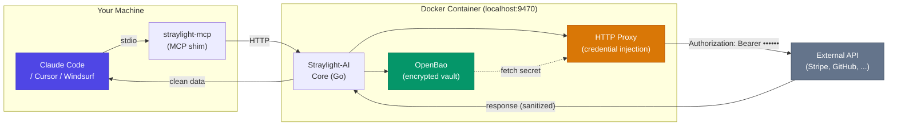
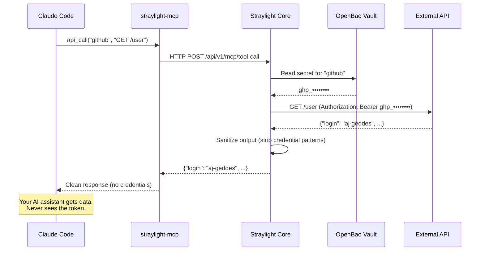

<p align="center">
  
</p>

<h1 align="center">Straylight-AI</h1>

<p align="center"><strong>Keep your API keys safe when using Claude Code, Cursor, and Windsurf.</strong></p>
<p align="center"><em>Use AI, with Zero trust.</em></p>

<p align="center">
  <a href="https://github.com/aj-geddes/straylight-ai/actions"></a>
  <a href="https://github.com/aj-geddes/straylight-ai/releases"></a>
  <a href="LICENSE"></a>
  <a href="https://aj-geddes.github.io/straylight-ai/docs/quickstart"></a>
</p>

## The Problem

Every time Claude Code reads your `.env` file, accesses shell history, or processes
log output, your API keys enter its context window. From there they can be echoed
in responses, logged to disk, or exfiltrated through prompt injection.

**This isn't theoretical.** CVE-2025-59536 demonstrated credential leakage via
crafted API responses. CVE-2026-21852 showed API key exfiltration through malicious
project configs.

## The Solution

Straylight-AI is a self-hosted credential proxy that sits between your AI coding
assistant and the outside world. You paste your API keys into a secure vault once.
When Claude Code, Cursor, or Windsurf needs to call an API, Straylight injects the
credential at the HTTP transport layer — **your keys never appear in the AI's
context window, prompts, logs, or responses.**

Beyond API key injection, Straylight now covers database access, cloud provider
credentials, project secret scanning, and a file firewall — all free, all
self-hosted.

## Quick Start

### Prerequisites

- Docker or Podman
- Node.js 18+

### Install (One Command)

```bash
npx straylight-ai
```

This will:
1. Pull and start the Straylight-AI container
2. Open the dashboard at http://localhost:9470
3. Register the MCP server with Claude Code (if installed)

### Add a Service

1. Open http://localhost:9470
2. Click "Add Service"
3. Select a template (GitHub, Stripe, OpenAI, etc.) or create a custom service
4. Paste your API key — it goes straight into the encrypted vault
5. Done. The key is stored securely and will never be shown again.

### Connect to Claude Code

If not auto-registered during setup:

```bash
claude mcp add straylight-ai --transport stdio -- npx straylight-ai mcp
```

### Works with Cursor and Windsurf Too

Any MCP-compatible AI coding assistant can use Straylight-AI. The MCP server
speaks the standard protocol over stdio.

### Use It

Just work normally with your AI coding assistant:

- "Check my GitHub issues"
- "What's my Stripe balance?"
- "Create an OpenAI completion"

Claude Code sees the Straylight-AI MCP tools and uses them automatically. Your
credentials never enter the conversation.

## How It Works



### Data Flow



The `straylight-mcp` shim runs on your host and communicates with your AI coding
assistant via stdio. It forwards MCP tool calls to the container over localhost
HTTP. The container fetches credentials from the encrypted vault and injects them
into outbound requests — **the AI only ever sees the API response, never the key.**

## Supported Services

Straylight-AI ships with 16 pre-configured templates:

| API Services | Cloud Providers | Databases | Other |
|-------------|----------------|-----------|-------|
| GitHub | AWS (+ STS temp creds) | PostgreSQL (+ dynamic credentials) | SSH Keys |
| Stripe | Google Cloud (+ WIF tokens) | MySQL (+ dynamic credentials) | Custom REST APIs |
| OpenAI | Azure (+ token exchange) | MongoDB | |
| Anthropic | | Redis (+ dynamic credentials) | |
| Slack | | | |
| GitLab | | | |
| Google | | | |

Cloud providers support temporary scoped credentials via AWS STS AssumeRole, GCP
Workload Identity Federation, and Azure token exchange — the AI runs cloud CLI
commands without ever seeing your access keys.

Database services support dynamic credential provisioning: Straylight creates
temporary database users with limited permissions and auto-revokes them when the
session ends. The AI queries the database without ever seeing the connection string
or password.

Each service supports multiple auth methods (PATs, API keys, service account
JSON, connection strings, etc.) — pick the one that matches your credential.

## CLI Reference

| Command | Description |
|---------|-------------|
| `npx straylight-ai` | Full setup (pull, start, register) |
| `npx straylight-ai start` | Start the container |
| `npx straylight-ai stop` | Stop the container |
| `npx straylight-ai status` | Check health and service status |

## MCP Tools

Once registered, your AI coding assistant has access to these tools:

| Tool | What It Does |
|------|-------------|
| `straylight_api_call` | Make an authenticated HTTP request. Credentials injected automatically. |
| `straylight_exec` | Run a command with credentials as environment variables. For cloud services, temporary scoped credentials are generated automatically. Output sanitized. |
| `straylight_check` | Check whether a credential is available for a service. Reports lease status and expiry for database and cloud services. |
| `straylight_services` | List all configured services and their status. |
| `straylight_db_query` | Query a database with temporary credentials that auto-expire. The AI never sees the database password. |
| `straylight_scan` | Scan project files for exposed secrets (API keys, tokens, connection strings) and get a report. |
| `straylight_read_file` | Read a file with secrets automatically redacted before the AI sees it. |

### Example

Your AI assistant calls:
```json
{ "service": "stripe", "method": "GET", "path": "/v1/balance" }
```

Straylight injects `Authorization: Bearer sk_live_...` into the request. The AI
gets the balance data back. It never sees or handles the key.

## Database Credentials

AI coding assistants routinely read `.env` files and `docker-compose.yml` configs
that contain database passwords. Once a connection string enters the AI's context,
it has been sent to the model provider, can be echoed in responses, and is
vulnerable to exfiltration via prompt injection.

Straylight solves this with dynamic database credentials powered by OpenBao's
database secrets engine.

**How to set it up:**

1. Open the dashboard at http://localhost:9470
2. Click "Add Service" and select a database type (PostgreSQL, MySQL, or Redis)
3. Enter the host, port, database name, and admin credentials — these are stored
   in the encrypted vault and used only by Straylight to create temporary users
4. Save. The AI can now query this database.

**How it works at runtime:**

When your AI assistant calls `straylight_db_query`, Straylight:

1. Provisions a temporary database user via `CREATE ROLE` with scoped permissions
2. Connects to the database using those temporary credentials
3. Executes the query and returns the results
4. The temporary user is auto-revoked when the lease expires (default: 15 minutes)

The AI never sees a username, password, or connection string. It only sees the
query results.

**Example tool call:**

```json
{ "service": "my-postgres", "query": "SELECT * FROM users LIMIT 5" }
```

**Credential TTL:** Default lease is 15 minutes, configurable up to 1 hour per
service. Credentials are revoked automatically on expiry — no manual cleanup
required.

**Supported databases:** PostgreSQL, MySQL/MariaDB, Redis.

## Cloud Credentials

AWS access keys, GCP service account JSON, and Azure credentials stored in
`.env` files or `~/.aws/credentials` are a common source of credential exposure.
AI coding assistants read these files as part of normal project work.

Straylight generates temporary, scoped cloud credentials on demand so the AI can
run cloud CLI commands without seeing your access keys.

**How to set it up:**

1. Open the dashboard and add a cloud service
2. For AWS: provide an IAM role ARN for STS AssumeRole
3. For GCP: provide a service account for token generation
4. For Azure: provide tenant ID, subscription ID, and app registration details
5. Save. The underlying credentials are stored in the vault.

**How it works at runtime:**

When your AI assistant calls `straylight_exec` with a cloud service, Straylight:

1. Generates temporary credentials (AWS STS, GCP token, Azure token)
2. Injects them as environment variables into the command execution
3. Runs the command inside the container and returns sanitized output

The AI never sees `AWS_ACCESS_KEY_ID`, `AWS_SECRET_ACCESS_KEY`, or session tokens.
It only sees the command output.

**Example tool call:**

```json
{ "service": "aws-prod", "command": "aws s3 ls" }
```

**Credential lifetime:** AWS STS sessions default to 15 minutes (configurable up
to 12 hours). GCP tokens default to 1 hour. All credentials are generated fresh
per invocation and never stored.

## Secret Scanner

Before the AI reads your project files, it can scan for exposed secrets and get a
map of what it should avoid.

Use `straylight_scan` at the start of a session to understand the risk surface,
or run it periodically to catch new secrets before they become a problem.

**What it detects:**

- AWS access keys (`AKIA...`)
- GitHub personal access tokens (`ghp_`, `github_pat_`)
- Stripe live and test keys (`sk_live_`, `sk_test_`)
- OpenAI API keys (`sk-proj-`, `sk-`)
- Private keys (RSA, EC, OpenSSH)
- `.env` files, `credentials.json`, `serviceAccountKey.json`
- Connection strings and database URLs
- Generic patterns: Bearer tokens, Basic auth headers

**What the output looks like:**

Each finding includes: file path, line number, pattern type, and severity. Secret
values are redacted in the output — the AI sees that a secret exists and where,
but not its value.

**Example tool call:**

```json
{ "path": ".", "generate_ignore": true, "severity_filter": "high" }
```

Setting `generate_ignore: true` returns ready-to-use ignore rules in
`.claudeignore` / `.cursorignore` format based on what was found.

## File Firewall

`straylight_read_file` reads files with secrets automatically redacted before the
content reaches the AI's context window. Use it instead of reading files directly
when the file may contain credentials.

**How it works:**

- Blocked file types (`.env`, `.pem`, `id_rsa`, `serviceAccountKey.json`, etc.)
  return a message directing the AI to use the vault instead of reading the file
  directly
- Structured config files (`docker-compose.yml`, `config.yaml`, etc.) are served
  with sensitive key values replaced by `[STRAYLIGHT:pattern]` placeholders — the
  AI sees the file structure and non-secret content, but not the secrets themselves
- The number of redactions and which patterns were matched are included in the
  response so the AI knows what was filtered

**Example tool call:**

```json
{ "path": "docker-compose.yml" }
```

If `docker-compose.yml` contains `POSTGRES_PASSWORD: hunter2`, the AI receives
`POSTGRES_PASSWORD: [STRAYLIGHT:password]` instead.

**Configurable rules:** The `firewall` section in your config controls which file
glob patterns trigger full blocking vs. value redaction, and which key names in
YAML/JSON/TOML files should have their values replaced.

## Claude Code Hooks (Optional)

For extra protection, add PreToolUse and PostToolUse hooks that block commands
like `echo $STRIPE_API_KEY` before they execute, and sanitize any credential
patterns that slip into tool output.

Add to `.claude/settings.json`:

```json
{
  "hooks": {
    "PreToolUse": [{
      "matcher": "Bash|Write|Edit",
      "hooks": [{ "type": "command", "command": "straylight-mcp hook pretooluse" }]
    }],
    "PostToolUse": [{
      "matcher": "Bash",
      "hooks": [{ "type": "command", "command": "straylight-mcp hook posttooluse" }]
    }]
  }
}
```

## Security

- **Encrypted at rest** — OpenBao (open-source HashiCorp Vault fork)
- **Transport-layer injection** — credentials added to HTTP requests inside the container, never exposed to the AI
- **Output sanitization** — two-layer detection strips credential patterns from API responses before they reach the AI
- **Dynamic credentials with automatic revocation** — database and cloud credentials are ephemeral; they expire and are revoked automatically, no long-lived secrets in AI context
- **Temporary cloud credentials** — AWS STS, GCP tokens, and Azure tokens generated fresh per invocation, never stored in AI context
- **Secret scanning before AI reads project files** — `straylight_scan` maps your credential exposure before the AI touches any file
- **File firewall with configurable block/redact rules** — `straylight_read_file` intercepts sensitive files and redacts secrets before they reach the AI
- **Credential audit trail** — every `straylight_api_call`, `straylight_exec`, and `straylight_db_query` is logged with timestamp, service, tool, and request summary (credentials redacted)
- **Non-root container** — runs as UID 10001, read-only filesystem, all capabilities dropped
- **Rate limiting and CORS** — dashboard locked to localhost

## FAQ

**Does my AI coding assistant ever see my credentials?**
No. Credentials stay inside the vault. The proxy injects them into HTTP requests.
The AI only receives the API response, which is also sanitized for credential patterns.

**Can the AI access my database directly?**
No. Straylight provisions a temporary database user with limited permissions and
proxies the query. The AI sends SQL to `straylight_db_query` and receives rows
back. It never sees a connection string, username, or password.

**Do I need to configure .claudeignore?**
Not if you use Straylight's file firewall. The `straylight_read_file` tool
automatically redacts secrets from any file before the AI sees the content.
You can still use `.claudeignore` for additional protection, but it is not
required when the file firewall is active.

**Does this work with Cursor and Windsurf?**
Yes. Any MCP-compatible AI coding assistant works. The MCP server speaks the
standard protocol over stdio.

**What happens if I restart the container?**
Credentials persist in the Docker volume at `~/.straylight-ai/data/`. The
container re-unseals the vault and is operational within seconds.

**Can I use services not on the template list?**
Yes. Select "Custom Service" and provide the base URL and auth method.

**Is this open source?**
Yes. MIT license. Self-hosted. No cloud dependency.

## Troubleshooting

**`npx straylight-ai` says Docker is not found**

Install Docker: https://docs.docker.com/get-docker/

**MCP tools not visible in Claude Code**

```bash
claude mcp add straylight-ai --transport stdio -- npx straylight-ai mcp
```
Then restart Claude Code.

**Container health check fails**

```bash
npx straylight-ai status
npx straylight-ai logs
```

## Documentation

| Guide | Description |
|-------|-------------|
| [Quick Start](https://aj-geddes.github.io/straylight-ai/docs/quickstart) | 5-minute setup guide |
| [User Guide](https://aj-geddes.github.io/straylight-ai/docs/user-guide) | Complete reference |
| [Features](https://aj-geddes.github.io/straylight-ai/features/) | Detailed feature breakdown |
| [Architecture](https://aj-geddes.github.io/straylight-ai/architecture/) | Technical deep dive |
| [FAQ](https://aj-geddes.github.io/straylight-ai/docs/faq) | Common questions |

## License

MIT — see [LICENSE](LICENSE)

---

<p align="center">
  Built by <a href="https://highvelocitysolutions-llc.com">High Velocity Solutions LLC</a><br>
  <a href="https://aj-geddes.github.io/straylight-ai/">Website</a> · <a href="https://aj-geddes.github.io/straylight-ai/docs/quickstart">Docs</a> · <a href="https://github.com/aj-geddes/straylight-ai/issues">Issues</a>
</p>
