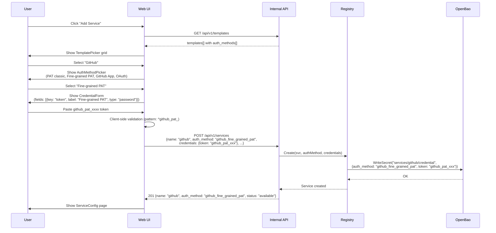
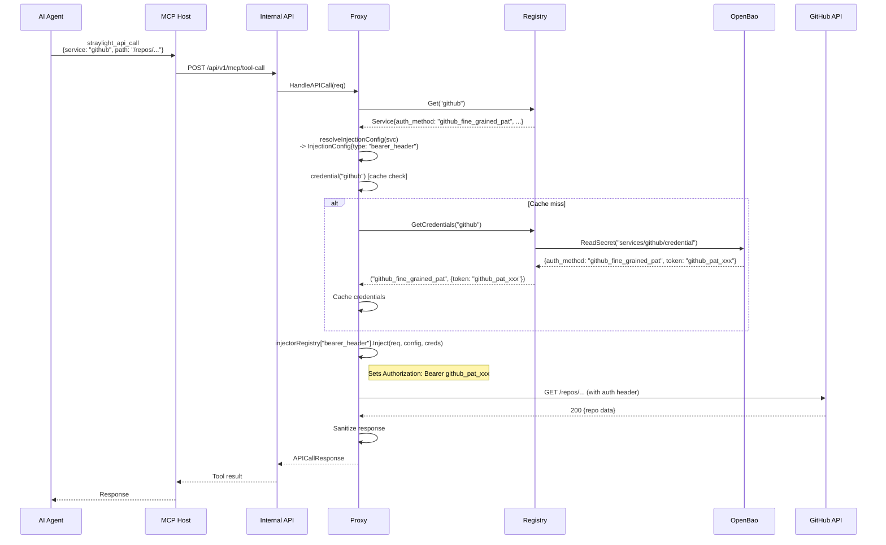
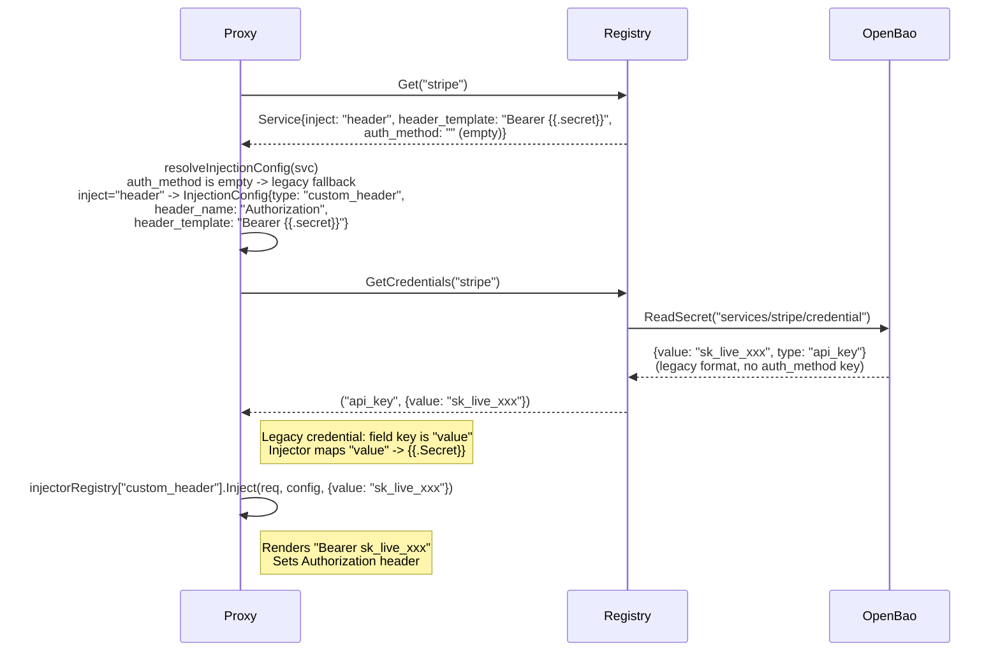
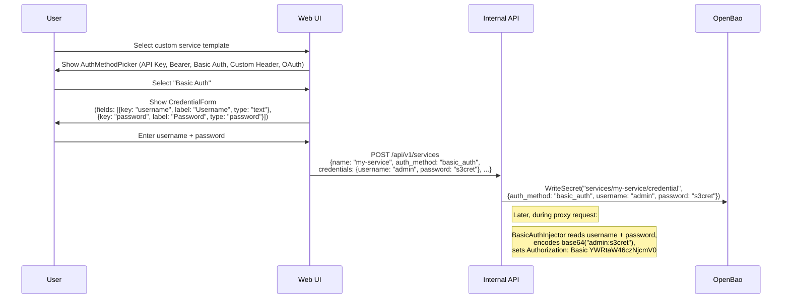
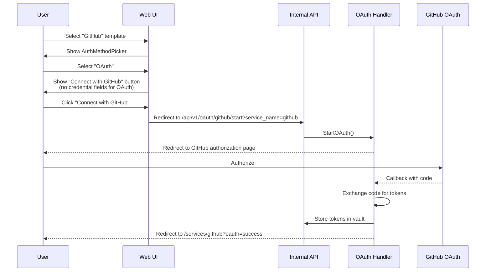

# Multi-Auth-Method Sequence Diagrams

## 1. Service Creation with Auth Method Selection

## 2. Proxy Request with Auth Method Dispatch

## 3. Legacy Service (Backward Compatibility)

## 4. Multi-Field Credential (Basic Auth Example)

## 5. OAuth Auth Method (Existing Flow, No Change)

